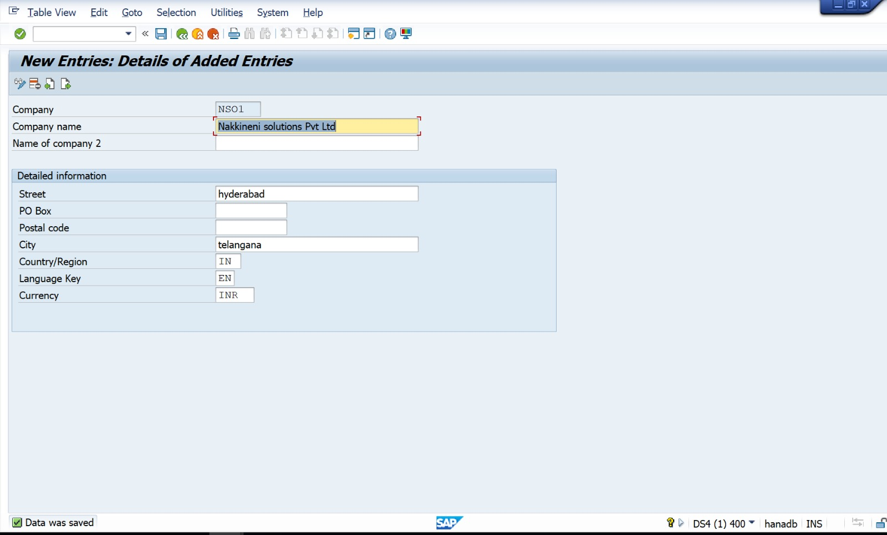
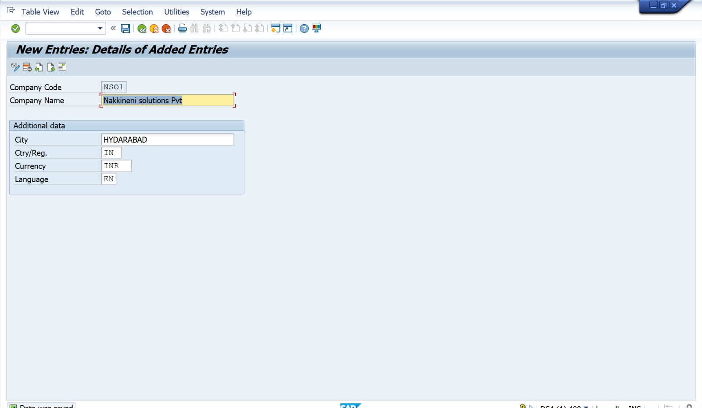
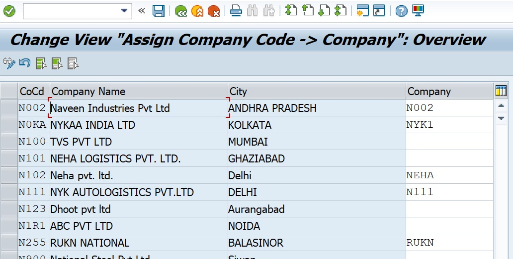
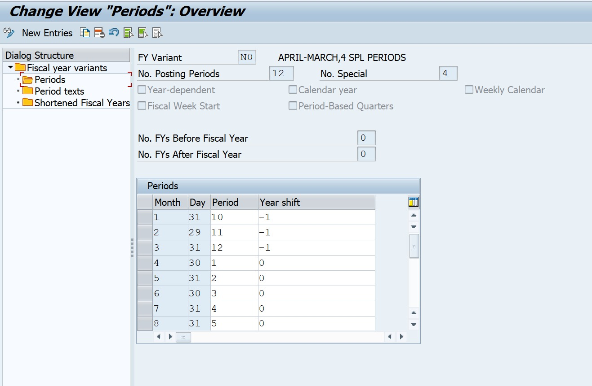
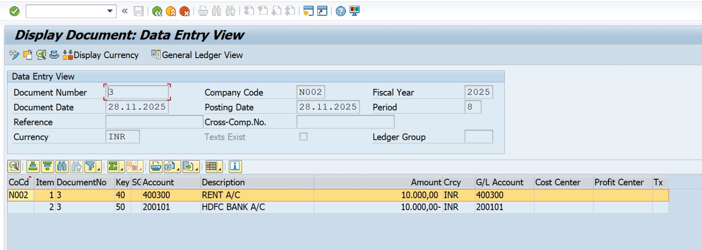

# SAP S/4HANA 2023 – FI Configuration Project
# Company Name: Nakkineni Solutions Pvt Ltd
# Project Name: Basic Financial Accounting Configuration
# Module: SAP FICO (Financial Accounting)
# Version: SAP S/4HANA 2023

 **1. Project Overview**
This project demonstrates the configuration of basic Financial Accounting settings in SAP S/4HANA 2023 for the company *Nakkineni Solutions Pvt Ltd*. The objective is to establish the FI enterprise structure, master data, and perform sample financial postings.

**2. Scope of Project**
- Create Financial Accounting Organizational Structure
- Configure Global Settings
- Create General Ledger Master Records
- Perform Financial Accounting Transactions
- Validate Accounting Document Postings

**3. Enterprise Structure Configuration & T-Codes**
| Step | Description | T-Code |
|------|-------------|--------|
| 1 | Create Company | OX15 |
| 2 | Create Company Code | OX02 |
| 3 | Assign Company to Company Code | OX16 |
| 4 | Define Business Area | OX03 |
| 5 | Define Fiscal Year Variant | OB29 |
| 6 | Assign FYV to Company Code | OB37 |
| 7 | Define Posting Period Variant | OBBO |
| 8 | Assign PPV to Company Code | OBBP |
| 9 | Define Field Status Variant | OBC4 |
| 10 | Assign FSV to Company Code | OBH1 |
| 11 | Define Document Types | OBA7 |
| 12 | Define Number Ranges | FBN1 |
| 13 | Create G/L Master Records | FS00 |

**4. Sample Accounting Posting**
  Transaction Posting
**T-Code: F-02**

| Account | Debit | Credit |
|----------|---------|--------|
| Rent Expense A/c | 10,000 | |
| Bank Account | | 10,000 |

**Narration:** Being rent paid

**Display Document**
**T-Code: FB03**

 **5. Testing & Validation**
- Document successfully posted
- Accounting entries validated
- GL accounts updated correctly

## **6. Conclusion**
The basic SAP FI configuration for *Nakkineni Solutions Pvt Ltd* is completed along with sample postings and validation.

**7. Screenshot List (Capture from SAP GUI)**
| Area | T-code | Screenshot |
|-------|--------|-------------|
| Create Company | OX15 | Entry Screen |
| Create Company Code | OX02 | Data Entry |
| Assignment | OX16 | Company & Code |
| Fiscal Year | OB29 | Variant |
| Posting Period | OBBO | Config |
| Document Type | OBA7 | View |
| Number Ranges | FBN1 | Range Screen |
| G/L Master | FS00 | GL Account |
| Document Posting | F-02 | Document Entry |
| Display | FB03 | Accounting Doc |

---

 **Author**
**Nakkineni Naveen Kumar**  
SAP FICO Consultant  
Naveen Solutions Pvt Ltd

## 📸 Screenshots

### 1. Create Company (OX15)

### 2. Create Company Code (OX02)

### 3. Assign Company and Company Code (OX16)

### 4. Define Fiscal Year Variant (OB29)

### 5. 5. Assign Fiscal Year Variant to Company Code (OB37)  

### 6. 6. Define Posting Period Variant (OBBO)  

### 7. 7. Assign Posting Period Variant to Company Code (OBBP)  

### 8. 8. Define Document Types (OBA7)  

### 9. 9. Create G/L Master (FS00)  

### 10. Accounting Posting (F-02)

### 11. Display Document (FB03)

