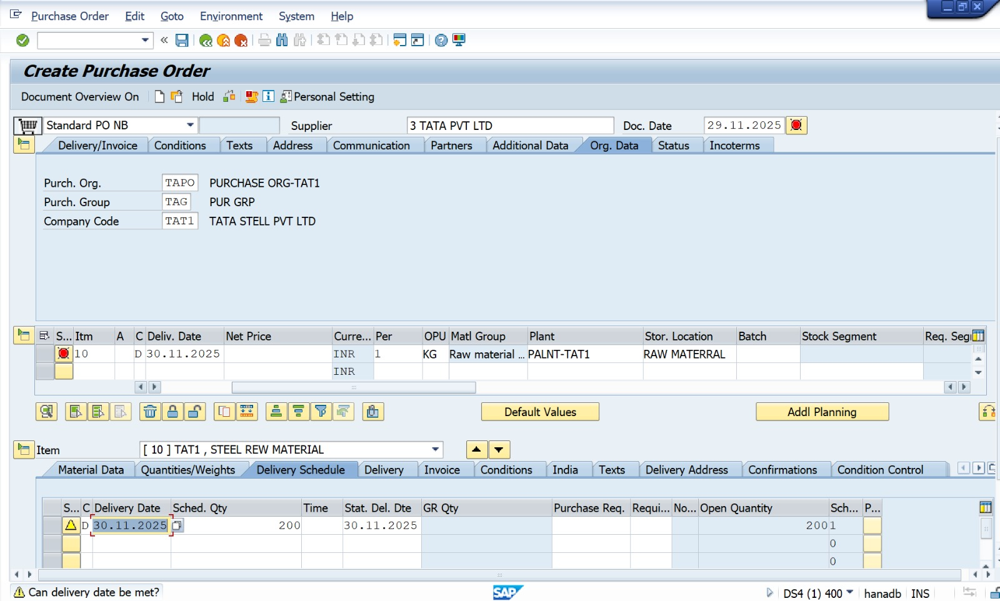
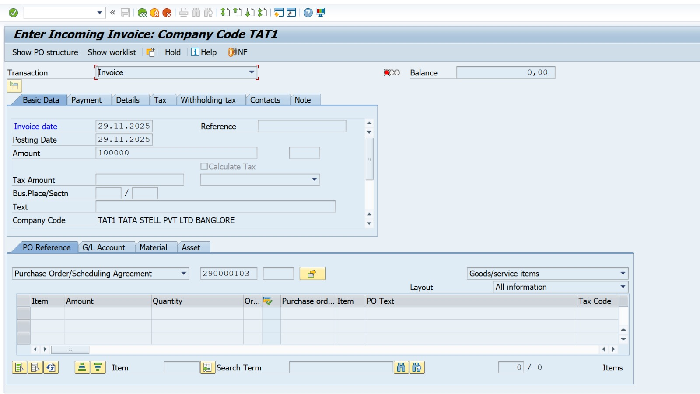
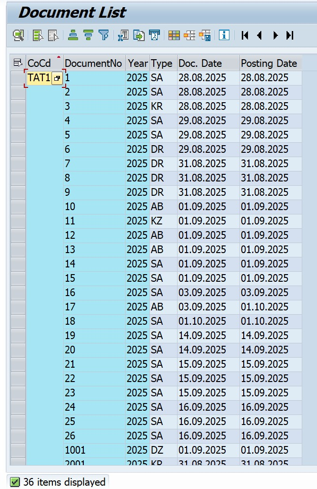

SAP Procure-to-Pay (P2P) End-to-End Cycle

Company Name: Nakkineni Solutions Pvt Ltd

Module: SAP MM + FI Integration

Version: SAP S/4HANA 2023

1. Business Scenario

Nakkineni Solutions Pvt Ltd purchases Office Furniture worth ₹30,000 from vendor Unity Suppliers Pvt Ltd.
The process includes Purchase Requisition → PO → Goods Receipt → Invoice Posting → Payment.

2. P2P Cycle Steps & T-Codes

Step	Activity	T-Code

1	Create Purchase Requisition	ME51N
2	Create Purchase Order	ME21N
3	Display Purchase Order	ME23N
4	Goods Receipt	MIGO
5	Display Material Document	MB03
6	Vendor Invoice Posting	MIRO
7	Display Invoice Document	FB03
8	Outgoing Payment to Vendor	F-53

3. Sample Posting Entry

Account	Debit	Credit

Furniture A/c	30,000	
Vendor A/c		30,000

Narration: Furniture purchased from vendor.

4. Screenshot List

Step	Screen Name	Upload Screenshot

ME51N	Purchase Requisition	
ME21N	Purchase Order	
MIGO	Goods Receipt	
MIRO	Invoice Verification	
F-53	Vendor Payment	

Author

Nakkineni Naveen Kumar
SAP FICO Consultant
Nakkineni Solutions Pvt Ltd

##  SAP P2P Cycle Screenshots

### 1. Purchase Order (ME21N)

### 2. Display Purchase Order (ME23N)

### 3. Goods Receipt (MIGO)

### 4. Invoice Posting (MIRO)

### 5. Display Invoice Document (FB03)

### 6. Vendor Payment (F-53)

