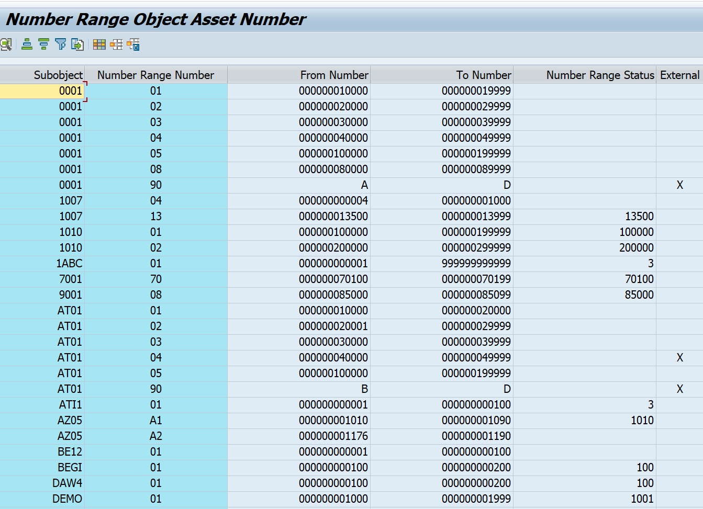

Project-03 – SAP-S4HANA-Asset Accounting (AA) End-to-End Project

SAP FICO Asset Accounting (AA) End-to-End Configuration & Posting

Company Name: Nakkineni Solutions Pvt Ltd
Module: SAP FICO – Asset Accounting
Version: SAP S/4HANA 2023

1. Business Scenario

Nakkineni Solutions Pvt Ltd acquires Office Furniture worth ₹1,50,000 and capitalizes it as a fixed asset under Furniture & Fixtures.
After capitalization, asset posting and reporting are performed using Asset Accounting.

2. Steps / Activities & T-Codes

Step	Activity	T-Code	Screenshot

1	Define Asset Class	OAOA	
2	Create Chart of Depreciation	OADB	
3	Assign Chart of Depreciation to Company Code	OAYZ	
4	Define Depreciation Area	AFAMA	
5	Define Asset Number Range	AS08	
6	Create Asset Master	AS01	
7	Asset Acquisition Posting (APC)	F-90	
8	Display Asset Values	AW01N	
9	Transfer Asset Data	OBCL	

3. Sample Posting Entry (F-90)

Account	Debit	Credit

Furniture A/c	1,50,000	
Vendor A/c		1,50,000

Narration: Office furniture purchased and capitalized.

### Screenshot References (SAP GUI)

#### 1. Define Asset Class (OAOA)

#### 2. Create Chart of Depreciation (OADB)

#### 3. Assign Chart of Depreciation to Company Code (OAYZ)

#### 4. Define Depreciation Area (AFAMA)

#### 5. Asset Retirement / Number Range (AS08)

#### 6. Display Asset Explorer Values (AW01N)

#### 7. Asset Acquisition Posting (F-90)

#### 8. Transfer Asset Data (OBCL)

