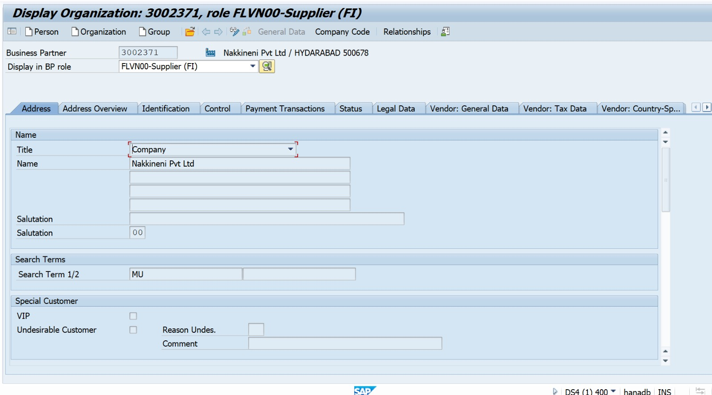
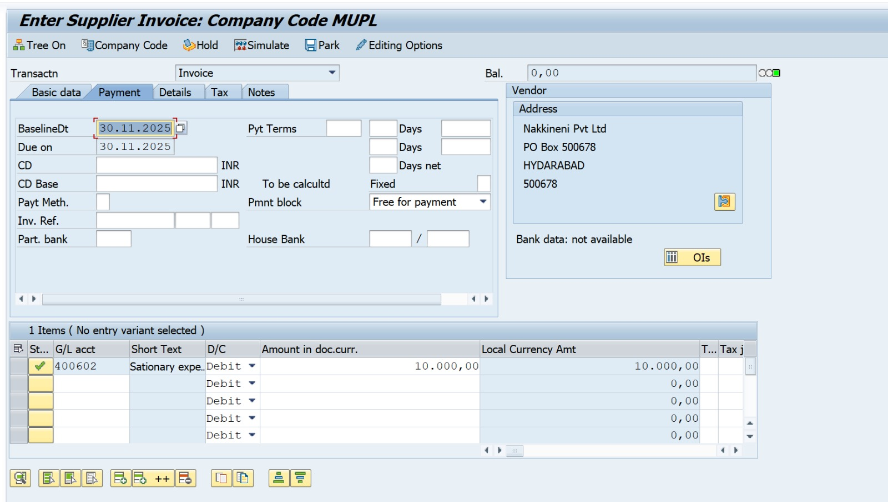
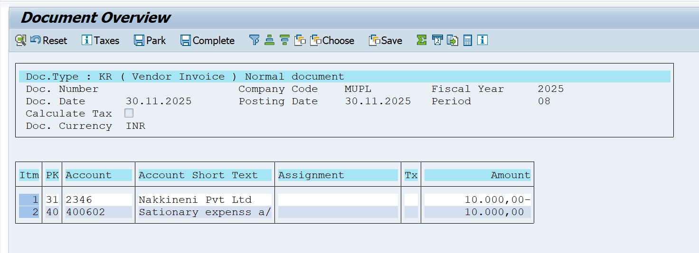
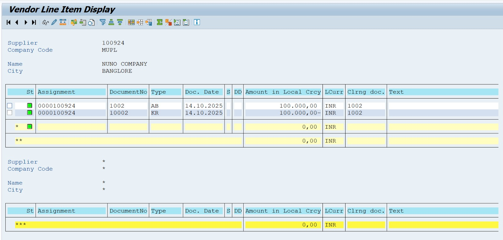
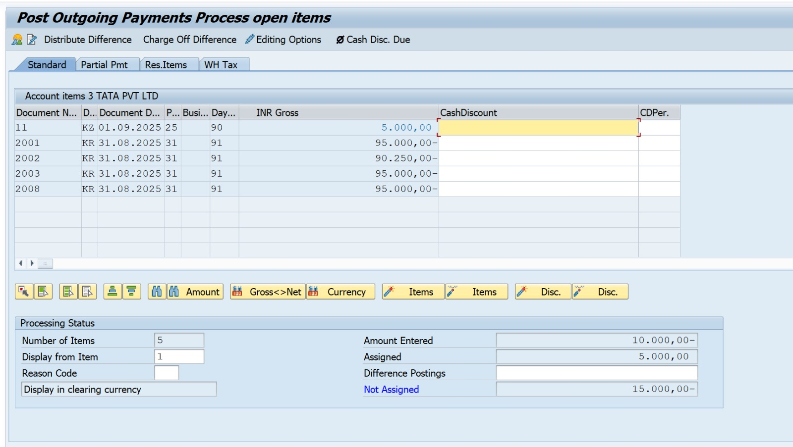
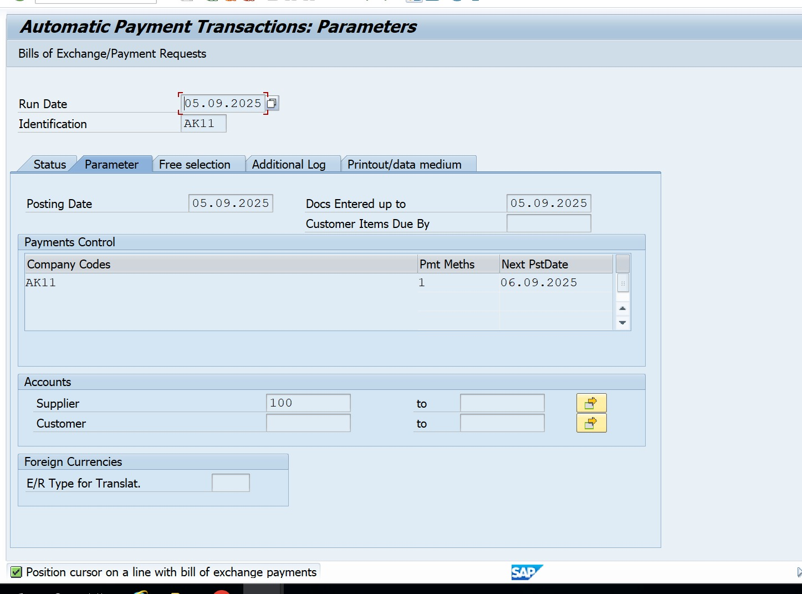
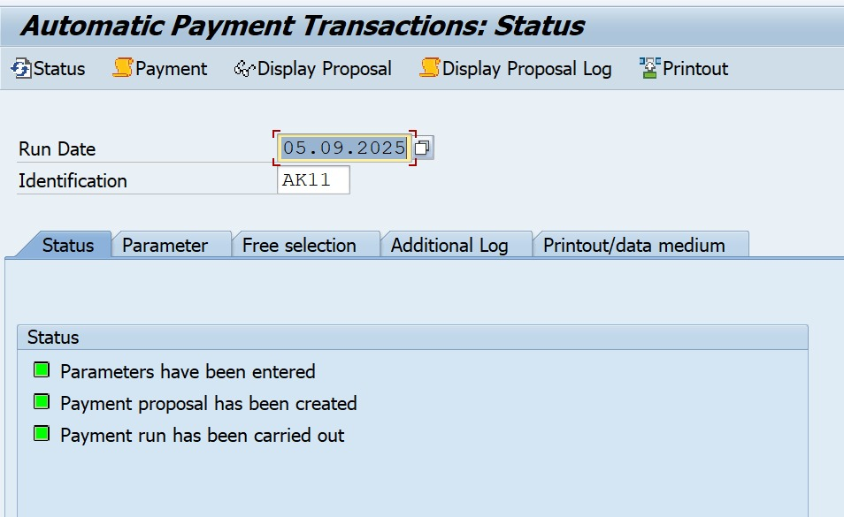
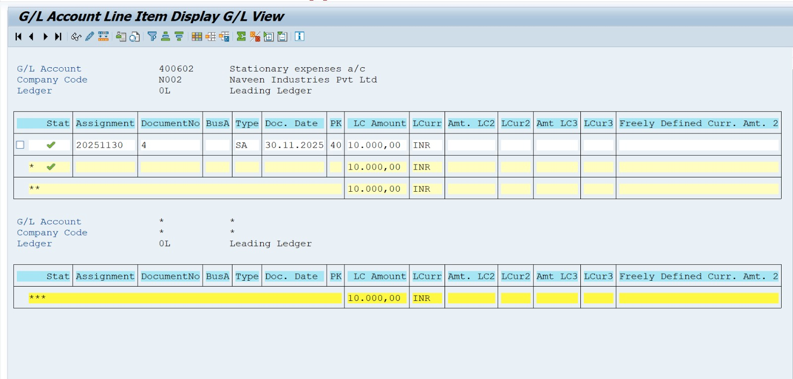

# SAP FICO – Accounts Payable (AP) End-to-End Cycle

### Company Name: Nakkineni Solutions Pvt Ltd  
### Module: SAP FI – Accounts Payable  
### Version: SAP S/4HANA 2023

##  Project Overview

This project demonstrates the complete Accounts Payable (AP) cycle in SAP S/4HANA 2023 for **Nakkineni Solutions Pvt Ltd**.  

The process covers:

- Vendor master creation  
- Invoice posting  
- Vendor line item display  
- Outgoing payment  
- Automatic Payment Program (F110) overview  
- GL & vendor reporting  

## 2. Business Scenario

Nakkineni Solutions Pvt Ltd receives an invoice for **office stationery worth ₹25,000** from vendor **Unity Suppliers Pvt Ltd**.  

The Accounts Payable team must:

1. Create a vendor master
2. Post the vendor invoice
3. Review vendor open items
4. Make payment to the vendor
5. Check the vendor & GL reports

## 3. AP Process Steps & T-Codes

| Step | Activity                         | T-Code |
|------|----------------------------------|--------|
| 1    | Create Vendor Master             | XK01   |
| 2    | Post Vendor Invoice              | FB60   |
| 3    | Display Vendor Line Items        | FBL1N  |
| 4    | Outgoing Payment to Vendor       | F-53   |
| 5    | Automatic Payment Run Overview   | F110   |
| 6    | Vendor GL Line Item Report       | FAGLL03 |

## 4. Sample Accounting Entries

### 4.1 Invoice Posting (FB60)

**Scenario:** Stationery purchase from Unity Suppliers – ₹25,000.

| Account               | Debit   | Credit  |
|-----------------------|---------|---------|
| Stationery Expense A/c| 25,000  |         |
| Vendor – Unity Supp.  |         | 25,000  |

**Narration:** Being stationery expense booked through vendor.

### 4.2 Manual Payment (F-53)

When paying the vendor:

| Account               | Debit   | Credit  |
|-----------------------|---------|---------|
| Vendor – Unity Supp.  | 25,000  |         |
| Bank A/c              |         | 25,000  |

**Narration:** Being payment made to vendor through bank.

## 5. Screenshot List (SAP GUI)

> Save your screenshots with exactly these file names  
> and upload them inside: `Project-04-SAP-S4HANA-AP-Accounts-Payable/screenshots/`

| Step | Screen Name               | File Name to Save                        |
|------|---------------------------|------------------------------------------|
| 1    | Vendor Creation (XK01)    | `XK01_Vendor_Creation.jpeg`             |
| 2    | Vendor Invoice (FB60)     | `FB60_Vendor_Invoice_Posting.jpeg`      |
| 3    | Vendor Line Items (FBL1N) | `FBL1N_Vendor_Line_Items.jpeg`          |
| 4    | Vendor Payment (F-53)     | `F53_Vendor_Payment.jpeg`               |
| 5    | Payment Run Overview      | `F110_Payment_Run_Overview.jpeg`        |
| 6    | Vendor GL Report          | `FAGLL03_Vendor_GL_Line_Items.jpeg`     |

---

## 6. Screenshot References (SAP GUI)

### 1. Vendor Master Creation (BP)

### 2. Vendor Invoice Posting (FB60)

### 3. FB60 Document Overview

### 4. Vendor Line Item Display (FBL1N)

### 5. Vendor Payment Posting (F-53)

### 6. Automatic Payment Run – Parameters (F110)

### 7. Automatic Payment Run – Status (F110)

### 8. Vendor GL Line Item Report (FAGLL03)

---

## Author

**Nakkineni Naveen Kumar**  
SAP FICO Consultant  
Nakkineni Solutions Pvt Ltd
