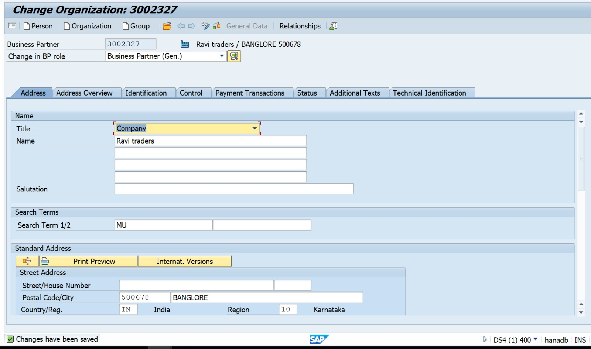
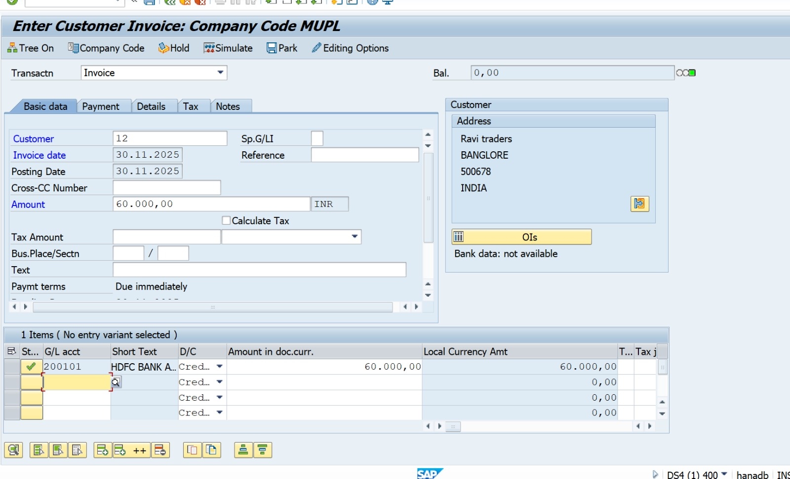
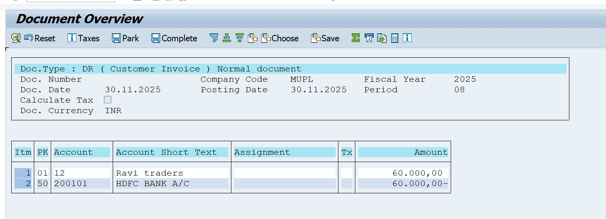
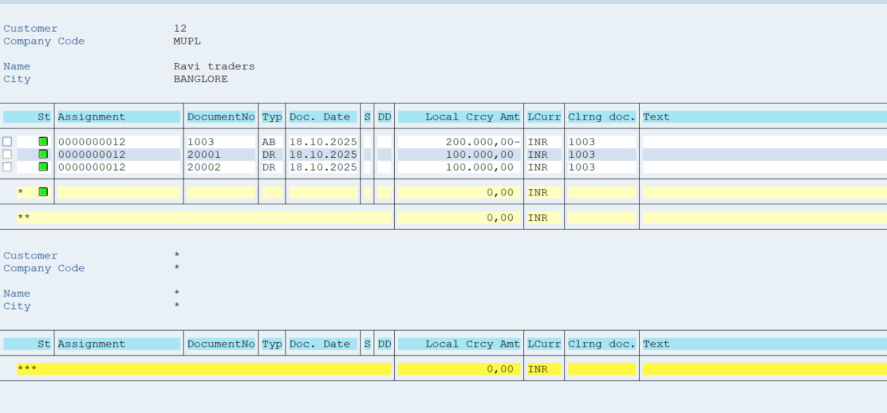
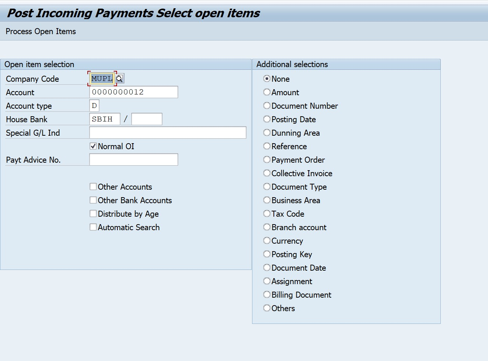
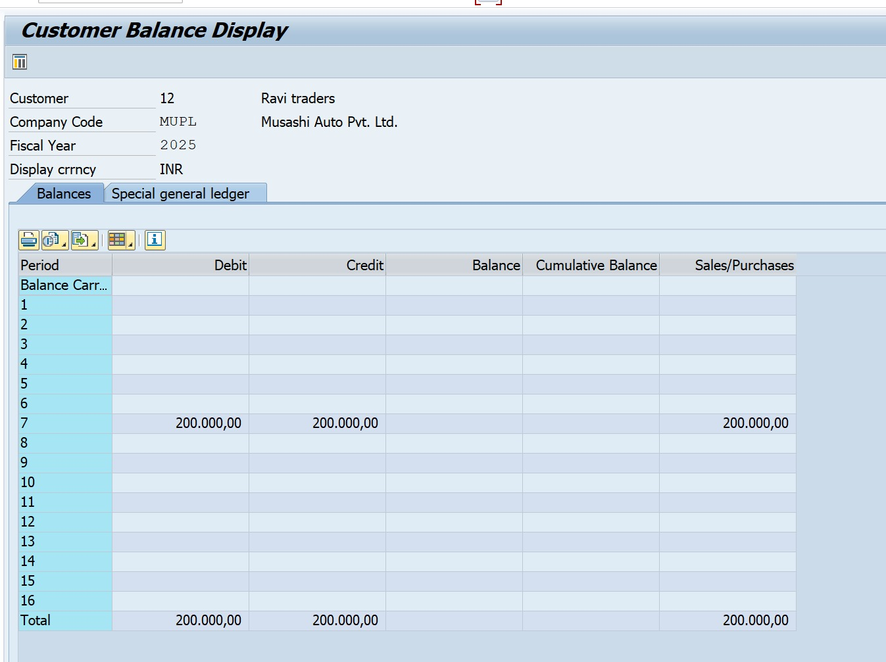
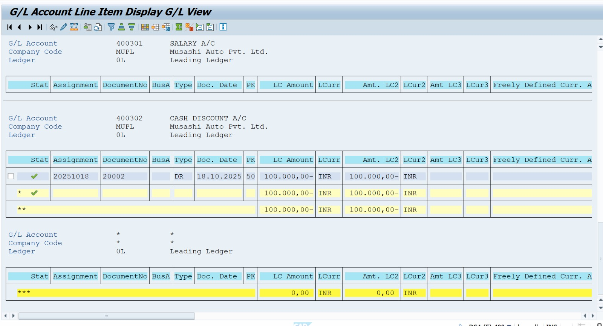

# SAP FICO – Accounts Receivable (AR) End-to-End Cycle

### Company Name: Nakkineni Solutions Pvt Ltd  
### Module: SAP FI – Accounts Receivable  
### Version: SAP S/4HANA 2023

---

## 1. Project Overview

This project demonstrates the complete Accounts Receivable (AR) cycle in SAP S/4HANA 2023 for **Nakkineni Solutions Pvt Ltd**.

The process covers:

- Customer master creation  
- Customer invoice posting  
- Customer line item display  
- Incoming payment from customer  
- Dunning / collection overview  
- G/L & customer reporting  

---

## 2. Business Scenario

Nakkineni Solutions Pvt Ltd sells **IT Services worth ₹60,000** to customer **Ravi Traders Pvt Ltd**.

The Accounts Receivable team must:

1. Create a customer master
2. Post the customer invoice
3. Review open items for the customer
4. Post incoming payment from the customer
5. Check the customer & GL reports

---

## 3. AR Process Steps & T-Codes

| Step | Activity                            | T-Code |
|------|-------------------------------------|--------|
| 1    | Create Customer Master              | BP     |
| 2    | Post Customer Invoice               | FB70   |
| 3    | Display Customer Line Items         | FBL5N  |
| 4    | Incoming Payment from Customer      | F-28   |
| 5    | Dunning / Collection View (optional)| F150 / FD10N |
| 6    | Customer GL Line Item Report        | FAGLL03 |

---

## 4. Sample Accounting Entries

### 4.1 Customer Invoice (FB70)

**Scenario:** Service revenue from customer – ₹60,000.

| Account                 | Debit  | Credit |
|-------------------------|--------|--------|
| Customer – Ravi Traders | 60,000 |        |
| Revenue A/c             |        | 60,000 |

**Narration:** Being service invoice raised on customer.

---

### 4.2 Incoming Payment (F-28)

When receiving payment from the customer:

| Account                 | Debit  | Credit |
|-------------------------|--------|--------|
| Bank A/c                | 60,000 |        |
| Customer – Ravi Traders |        | 60,000 |

**Narration:** Being payment received from customer in bank.

---

## 5. Screenshot List (SAP GUI)

> Save your screenshots with exactly these file names  
> and upload them inside:  
> `Project-05-SAP-S4HANA-AR-Accounts-Receivable/screenshots/`

| Step | Screen Name                           | File Name to Save                               |
|------|---------------------------------------|-------------------------------------------------|
| 1    | Customer Master Creation (BP)         | `BP_Create_Customer_Master.jpeg`               |
| 2    | Customer Invoice Posting (FB70)       | `FB70_Customer_Invoice_Posting.jpeg`          |
| 3    | Customer Line Items Display (FBL5N)   | `FBL5N_Customer_Line_Items.jpeg`               |
| 4    | Incoming Payment from Customer (F-28) | `F28_Incoming_Payment_Posting.jpeg`           |
| 5    | Customer Balance / Dunning Overview   | `FD10N_Customer_Balance_Display.jpeg`         |
| 6    | Customer GL Line Item Report          | `FAGLL03_Customer_GL_Line_Items.jpeg`         |

## 6. Screenshot References (SAP GUI)

### 1. Customer Master Creation (BP)

### 2. Customer Invoice Posting (FB70)

### 3. FB70 Document Overview

### 4. Customer Line Items Display (FBL5N)

### 5. Incoming Payment Posting (F-28)

### 6. Customer Balance Display (FD10N)

### 7. Customer GL Line Item Report (FAGLL03)

## Author

**Nakkineni Naveen Kumar**  
SAP FICO Consultant  
Nakkineni Solutions Pvt Ltd
