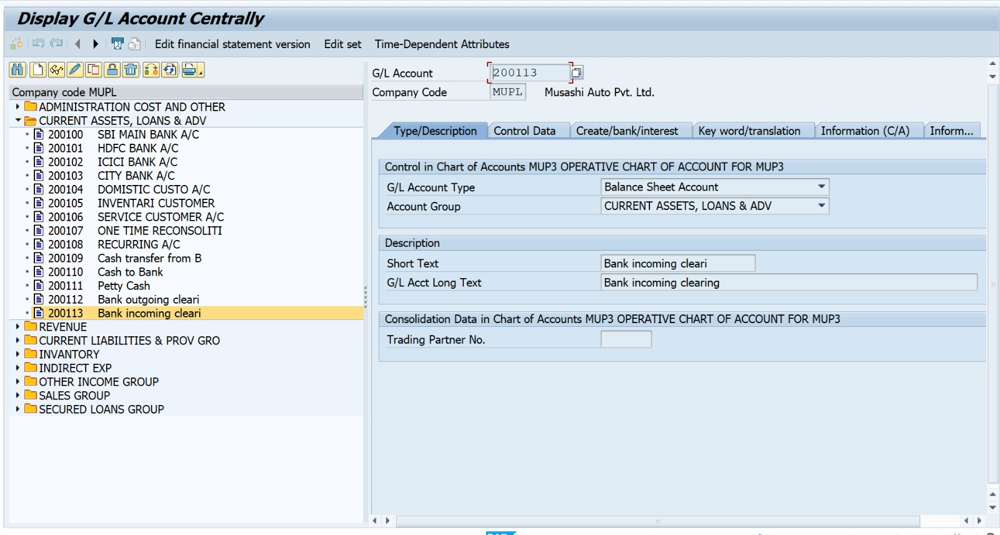
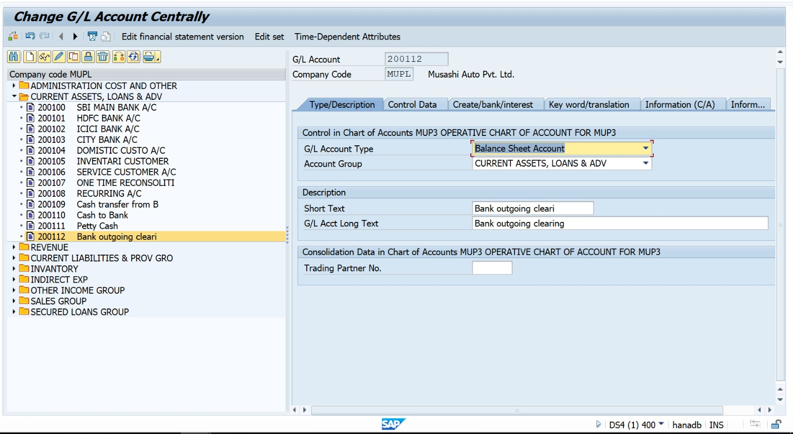
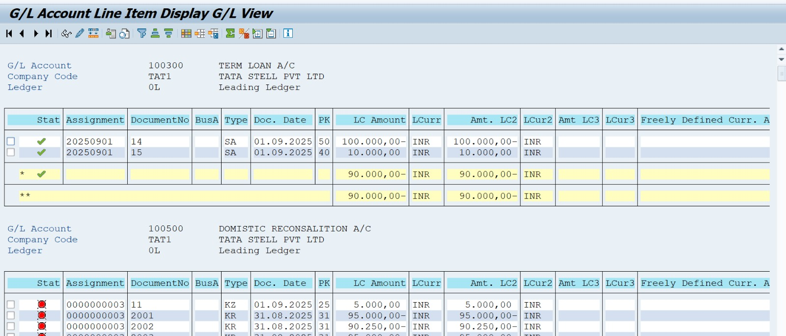

Project-06: SAP FICO – Bank Accounting (House Bank & Bank Reconciliation)

 Business Scenario

Nakkineni Solutions Pvt Ltd wants to maintain bank accounts for business payments.
You will configure House Bank, Account ID, create GL accounts, and perform Bank Reconciliation (manual).

 Project Steps & T-Codes

Step	Activity	T-Code	Screenshot to Capture

1	Create Bank GL Account	FS00	Bank Main GL
2	Create Outgoing Bank Sub Account	FS00	Bank Outgoing GL
3	Create Incoming Bank Sub Account	FS00	Bank Incoming GL
4	Create House Bank	FI12	House Bank window
5	Create Account ID	FI12	Account ID with GL mapping
6	Manual Bank Statement Posting	FF67	Posting screen
7	Display Bank Ledger	FBL3N / FAGLL03	Display statement

 House Bank Master Configuration Example

1️ Create Main Bank Account (FS00)

Account Group: Bank Accounts

Account Type: Balance Sheet Account

Short Text: SBI Bank Main A/c

2️ Create Sub Ledger Accounts

GL	Description

113100	SBI Bank Incoming Clearing
113200	SBI Bank Outgoing Clearing

3️ Create House Bank

FI12 → New Entries
House Bank: HDFC
Bank Country: IN
Bank Key: 123456
Bank Name: SBI BANK LTD

4️ Create Account ID

Account ID: MAIN
Currency: INR
GL Account: 113100

5️. Manual Bank Statement Posting

FF67 → Posting → Save document
FSGLL03- GL View

##  Screenshot References (SAP GUI)

### **1. Create Bank Main G/L Account (FS00)**

### **2. Create Incoming Bank Sub Account (FS00)**

### **3. Create Outgoing Bank Sub Account (FS00)**

### **4. Create House Bank (FI12)**

### **5. Create Bank Account ID (FI12)**

### **6. Manual Bank Statement Posting (FF67)**

### **7. Bank G/L Line Item Display (FAGLL03)**

Outcome
✔ House Bank successfully created and assigned  
✔ Bank Accounts configured and mapped with G/L Accounts  
✔ Manual Bank statement posting completed  
✔ Bank reconciliation validated via G/L line item display

