Project 07 – SAP FICO Withholding Tax (TDS) Implementation (End-to-End)

Module: SAP FI – AP

Version: SAP S/4HANA 2023

Scenario: TDS deduction on vendor payments

 Business Scenario

Nakkineni Solutions Pvt Ltd receives a vendor invoice from Unity Suppliers Pvt Ltd for ₹50,000 for professional services.
As per Indian Income Tax rules, TDS 10% must be deducted at the time of invoice posting.

So accounting entry should be:

Account	Debit	Credit

Expense A/c (Professional Charges)	50,000	
TDS Payable 10%		5,000
Vendor Payable		45,000

 Configuration Steps & T-Codes

Step	Activity	T-Code

1	Activate Extended Withholding Tax	SPRO
2	Create Withholding Tax Type	OBC4
3	Create Withholding Tax Code	FTXP
4	Assign Withholding Tax Type to Company Code	OBYZ
5	Assign WHT to Vendor Master	BP / XK02
6	Post Vendor Invoice with TDS	FB60
7	Display Vendor Line Items	FBL1N
8	Display TDS Balances	FAGLL03

### **1. Activate Extended Withholding Tax (SPRO)**

### **2. Define Withholding Tax Types (SPRO)**
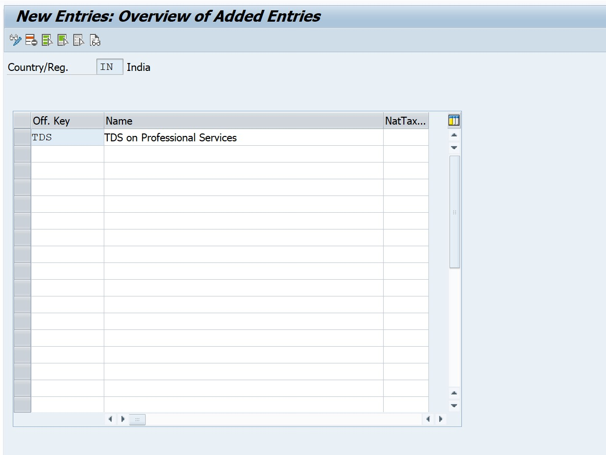

### **3. Define Exemption Reasons (SPRO)**
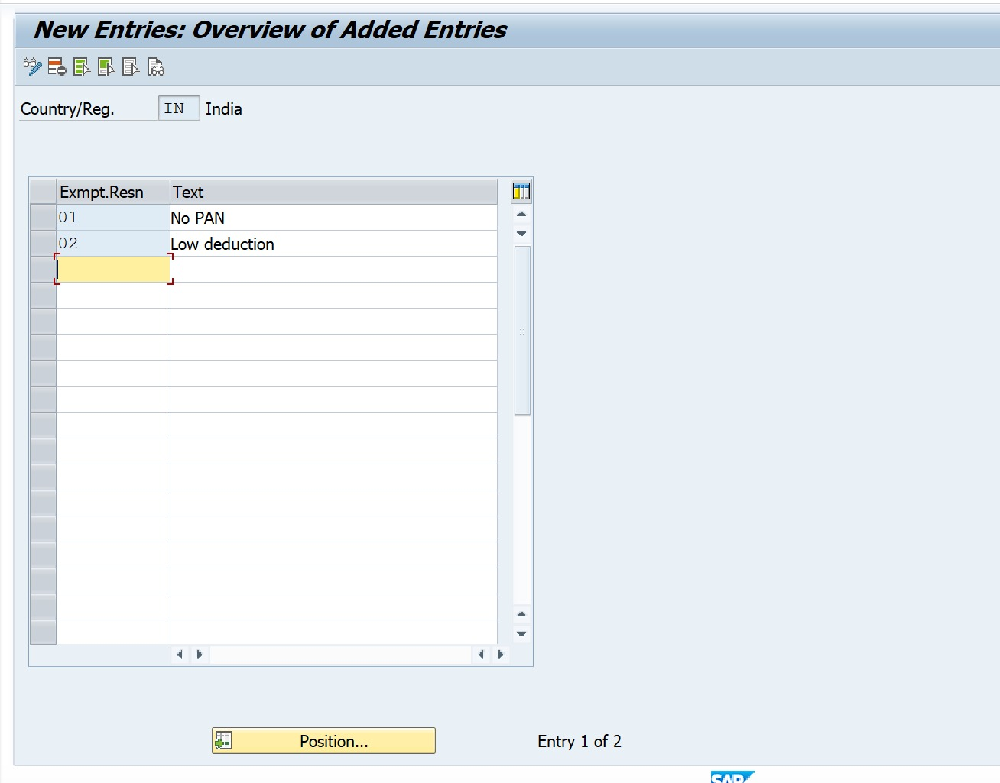

### **4. Withholding Tax Country & Region (SPRO)**
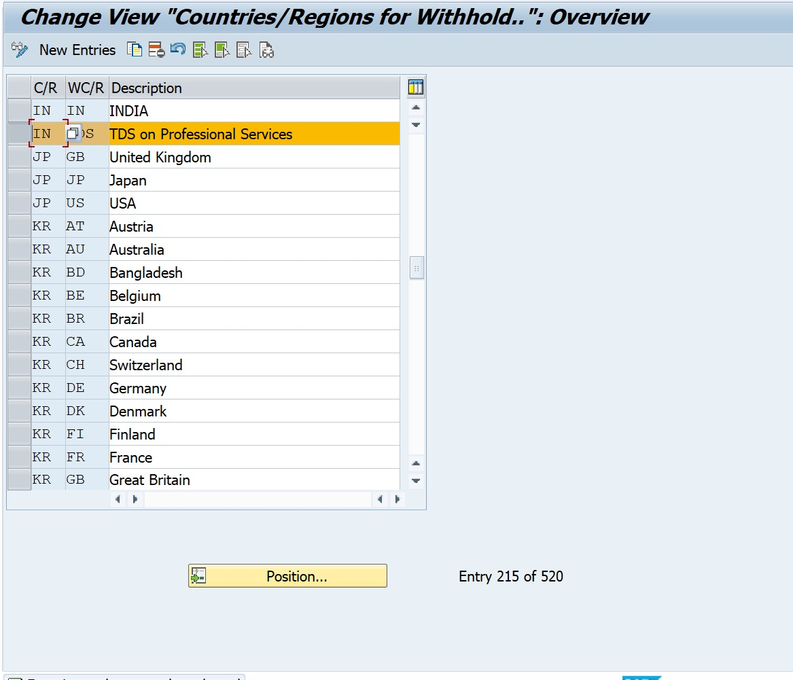

### **5. Define Tax Calculation Rules (SPRO)**
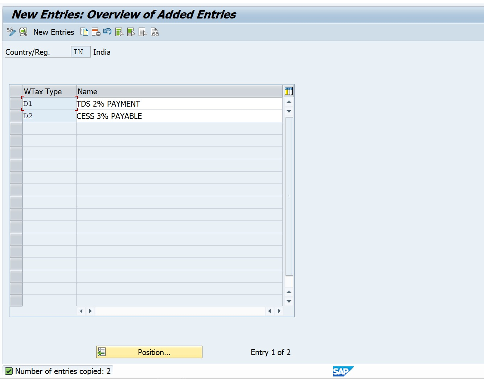

### **6. Assign Withholding Tax Types to Company Code (SPRO)**
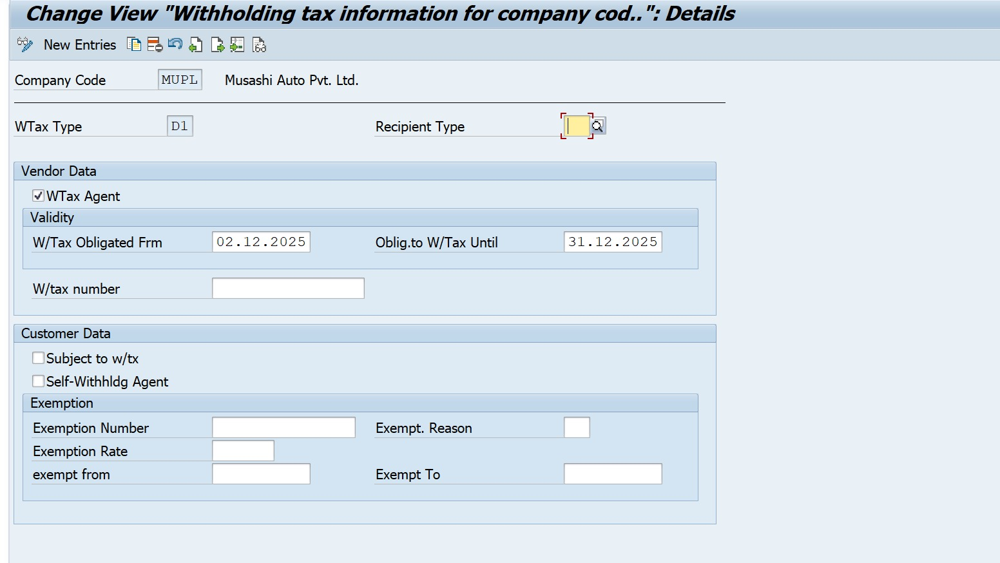

### **7. Assign G/L Accounts for TDS**
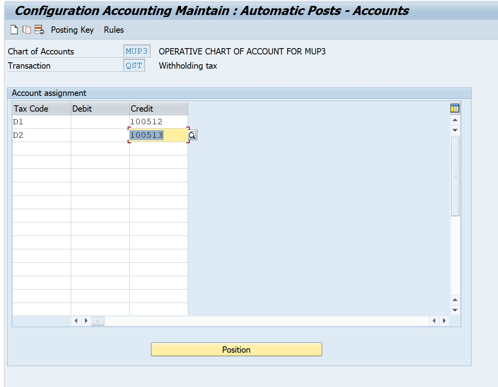

### **8. Professional Fees G/L (FS00)**
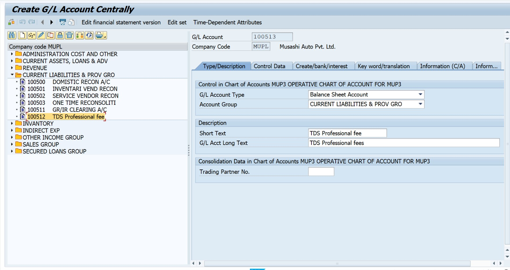

### **9. Contractor Fees G/L (FS00)**
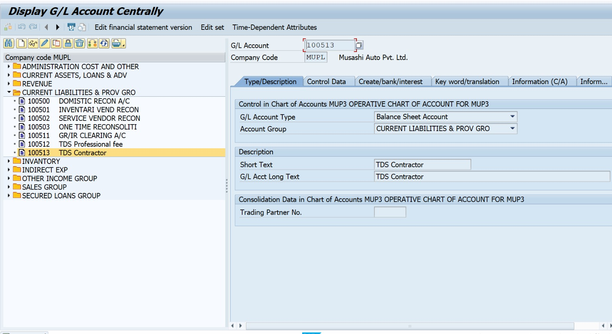

### **10. TDS Payable G/L (FS00)**
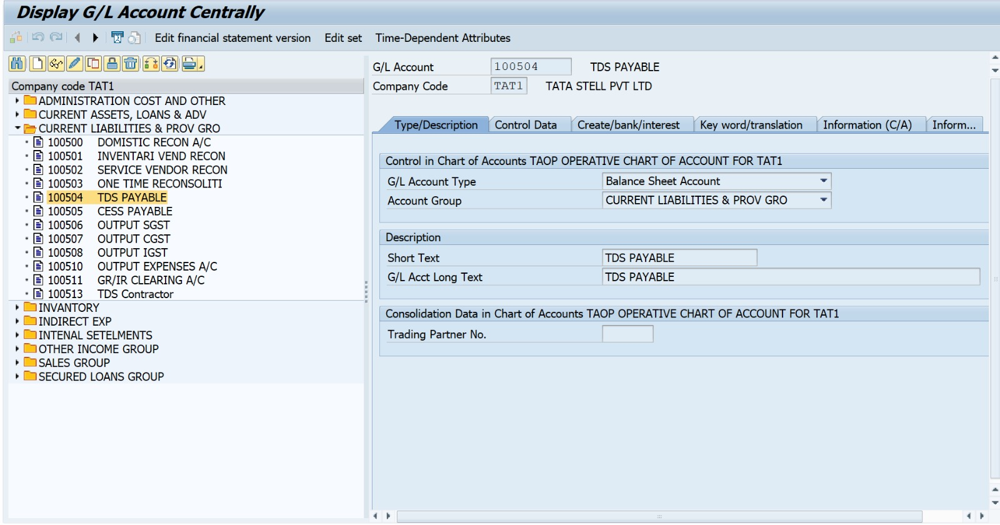

### **11. Vendor Master Creation (BP)**
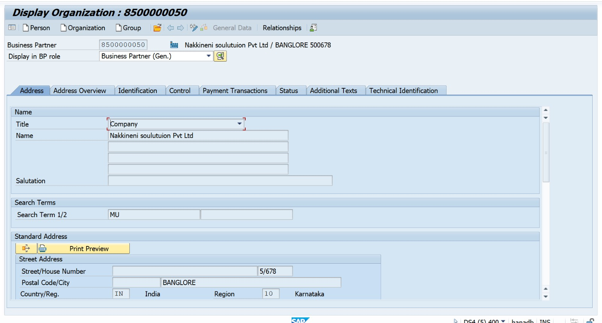

### **12. Vendor Withholding Tax Tab (BP)**
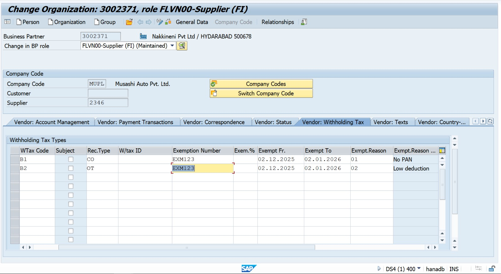

### **13. Vendor Invoice Posting with TDS (FB60)**
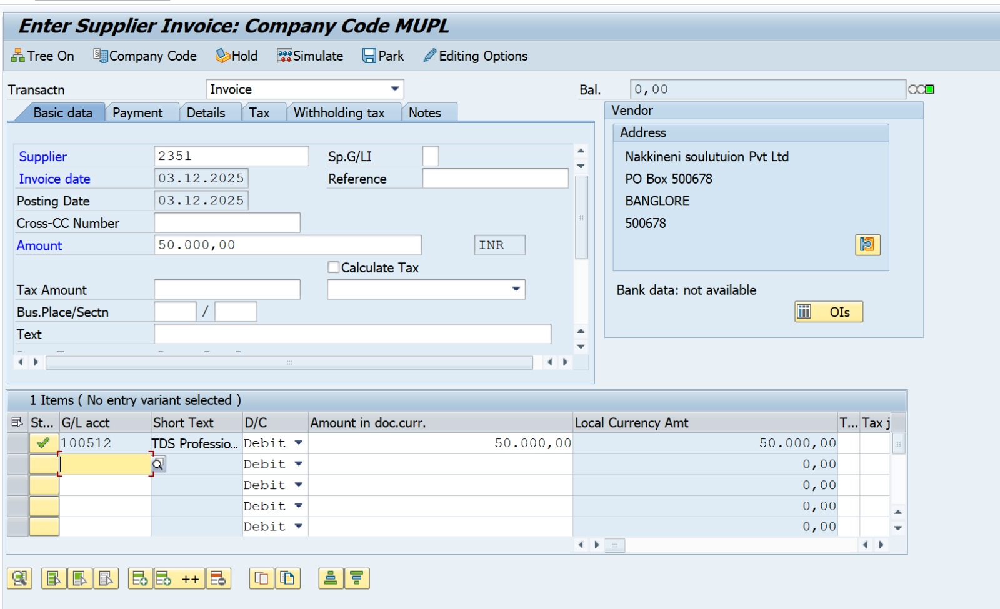

### **14. Document Overview (FB60)**
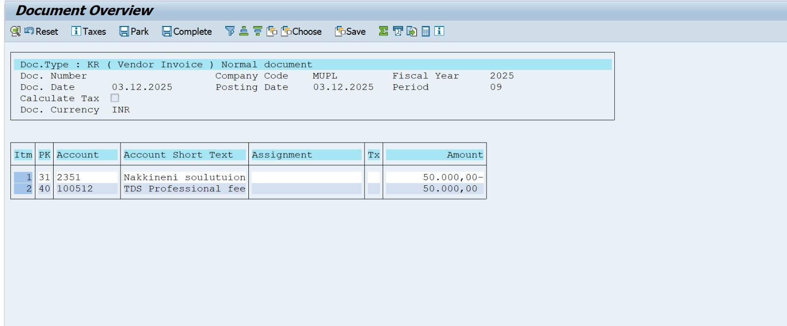

### **15. Vendor Line Items (FBL1N)**
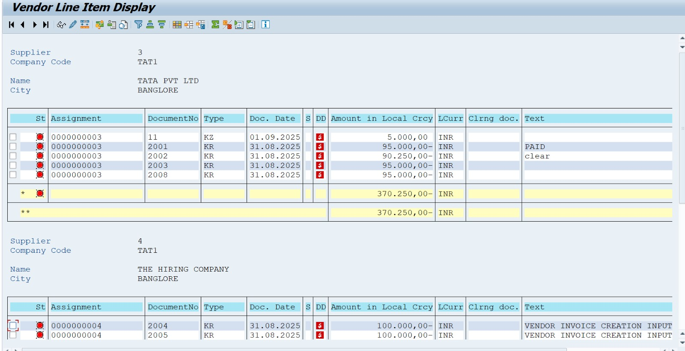

### **16. TDS GL Line Item Display (FAGLL03)**
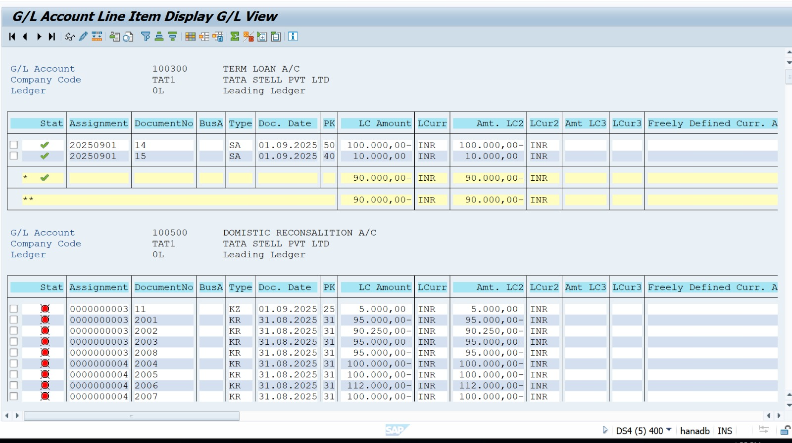
