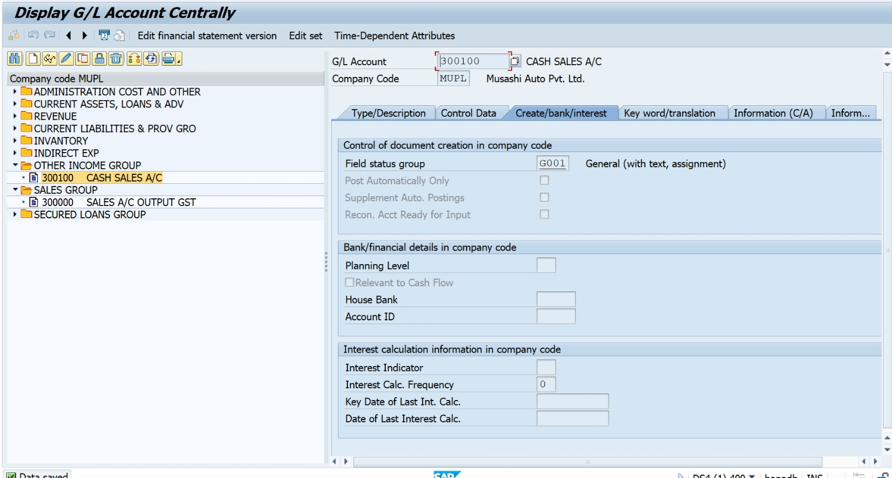
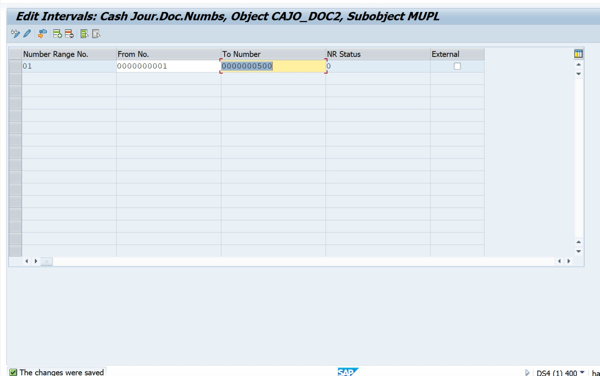
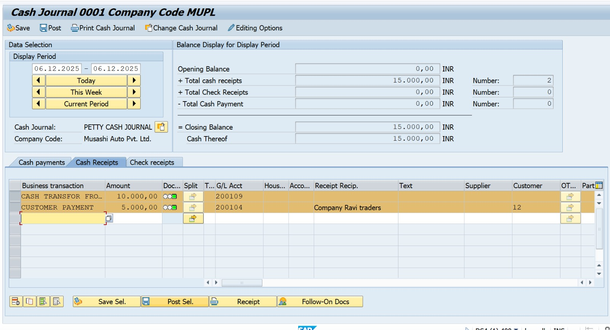

Project 09 – Petty Cash Journal in SAP S/4HANA

 Business Objective

The purpose of this project is to configure and manage Petty Cash transactions in SAP S/4HANA to record small everyday business expenses and receipts efficiently without involving major banking processes. This enables organizations to monitor day-to-day expenses, maintain transparency, and ensure proper accounting control.

---

 Business Scenario

Musashi Auto Pvt. Ltd. maintains a petty cash book for daily operational activities such as employee reimbursements, small purchases, and urgent payments.
In this project, we created Petty Cash Journal and posted the following transactions:

Cash received from Customer

Cash received from Bank

Cash Purchase (Cash Expense)

Cash Payment to Vendor

Cash Transfer Entry

Printed Cash Journal Report

---

 ##  SAP Configuration Steps (With T-Codes)

| Step No | Configuration Activity | T-Code |
|--------:|------------------------|--------|
| 1 | Create Cash on Hand Account | FS00 |
| 2 | Create Cash Purchase Expense Account | FS00 |
| 3 | Create Cash Sales Account | FS00 |
| 4 | Create Petty Cash Account | FS00 |
| 5 | Define Number Range for Cash Journal | FBCJC1 |
| 6 | Set Up Cash Journal | FBCJC0 |
| 7 | Assign Business Transactions to Cash Journal | FBCJC2 |
| 8 | Define Print Parameters for Cash Journal | FBCJC3 |
| 9 | Post Petty Cash Transactions | FBCJ |

---
##  Posting Cash Transactions in FBCJ

| Type | Transaction Description | Amount (INR) | T-Code |
|------|-------------------------|--------------|--------|
| Receipt | Customer Cash Receipt | 5,000 | FBCJ |
| Receipt | Cash Transfer From Bank | 10,000 | FBCJ |
| Expense | Vendor Payment | 2,000 | FBCJ |
| Expense | Cash Purchase Expense | 3,000 | FBCJ |
| Expense | Cash Transfer To Bank | 10,000 | FBCJ |

 Business Outcome

Successfully posted cash receipts and cash payments using Petty Cash Journal

Cash journal balances updated automatically based on transactions

Printable journal report generated for audit and financial tracking

Enabled control over daily petty expenses with complete ledger traceability

Cash Receipts Posting (FBCJ)

In this screen, two receipts were posted in the Cash Receipts tab:

Business Transaction	Amount (INR)	Account / Description

Customer Payment	5,000	Collected from Customer
Cash Transfer From Bank	10,000	Cash transferred from Bank Account to Petty Cash

 Result After Posting Receipts

Posting Type	Total Amount

Total Receipts	₹ 15,000
Opening Balance	₹ 0
Closing Balance	₹ 15,000

The closing balance updated automatically based on the total receipts entered.

 Cash Payments Posting (FBCJ)

In this screen, cash payments & expense transactions were posted in the Cash Payments tab:

Business Transaction	Amount (INR)	Account / Description

Vendor Payment	2,000	Payment made to Supplier
Cash Purchase	3,000	Expense entry for purchasing goods
Cash Transfer To Bank	10,000	Cash moved back to bank
 
Result After Posting Payments

Posting Type	Total Amount

Total Payments / Expenses	₹ 15,000

Printed Petty Cash Journal Report

This report displays the summary of all receipts and payments posted on 06.12.2025:

Particulars	Amount (INR)

Total Receipts	₹ 15,000
Total Expenses / Cash Payments	₹ 15,000
Closing Balance	₹ 0.00

Outcome

The closing balance became zero, meaning all received cash was fully utilized and accounted for.
All the entries show Posted status, confirming successful processing.

Final Summary

Successfully configured Petty Cash Journal and created number ranges & journal structure

Posted incoming cash, outgoing expenses, vendor payment & internal transfer

Generated printable audit-format cash report

Accurate ledger updates and transparent cash flow tracking

### Transaction Posting Summary (FBCJ)
- Cash received from Customer: ₹5,000
- Cash received from Bank Transfer: ₹10,000
- Cash Payment to Vendor: ₹2,000
- Cash Purchase Expense: ₹3,000
- Cash Transfer back to Bank: ₹10,000

 Printed Petty Cash Journal – Final Summary

| Particular | Amount (INR) |
|------------|--------------|
| Opening Balance | 0.00 |
| Total Receipts | 15,000 |
| Total Payments / Expenses | 15,000 |
| **Closing Balance** | **0.00** |

##  Screenshots

### 01. Cash From Bank Account (FS00)

### 02. Cash To Bank Account (FS00)

### 03. Cash Purchase Expense Account (FS00)

### 04. Cash Sales Account (FS00)

### 05. Petty Cash Account (FS00)

### 06. Define Number Range (FBCJC1)

### 07. Setup Cash Journal (FBCJC0)

### 08. Assign Business Transactions (FBCJC2)

### 09. Define Print Parameters (FBCJC3)

### 10. Cash Receipt Entry (FBCJ)

### 11. Cash Payment Entry (FBCJ)

### 12. Print Petty Cash Journal (FBCJ)

