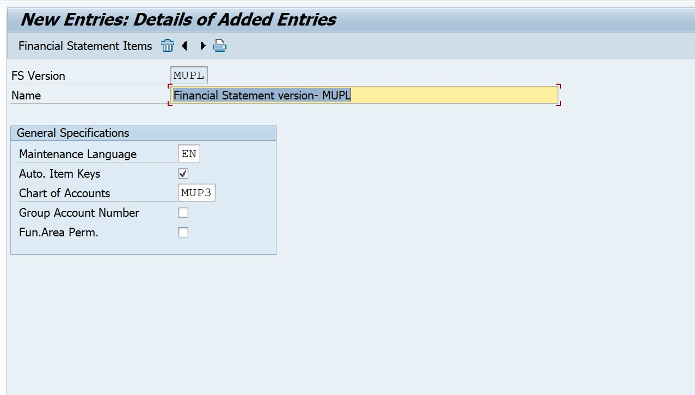
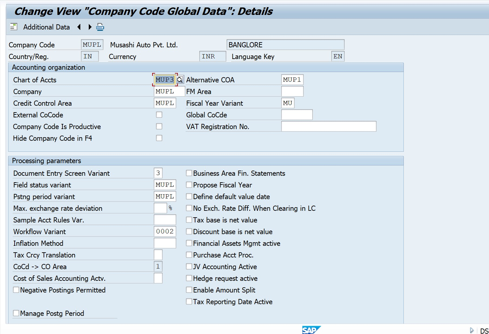
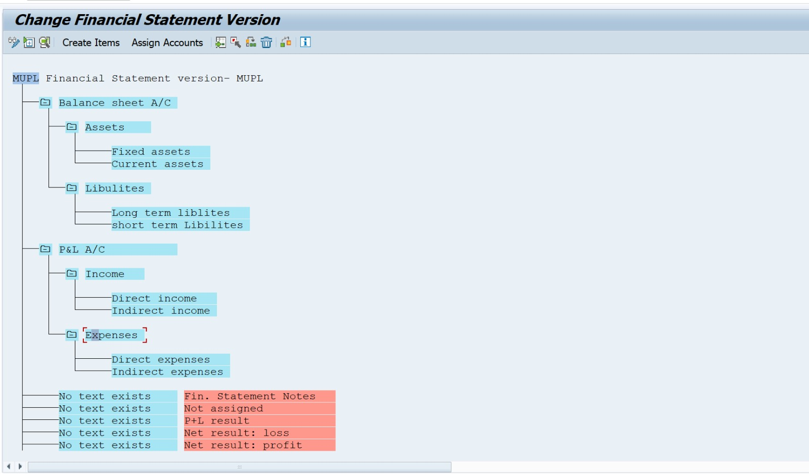
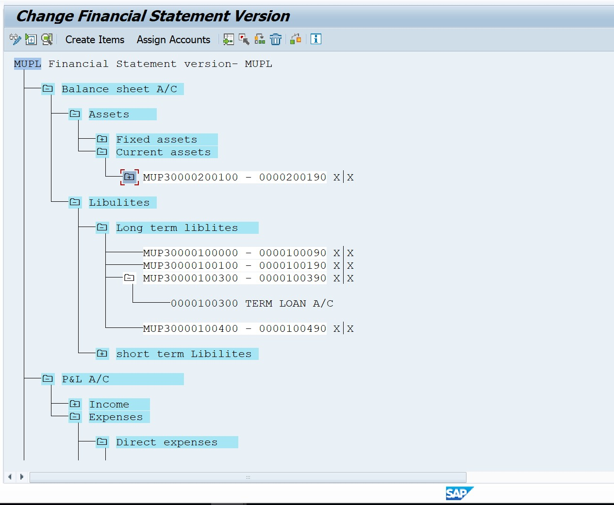
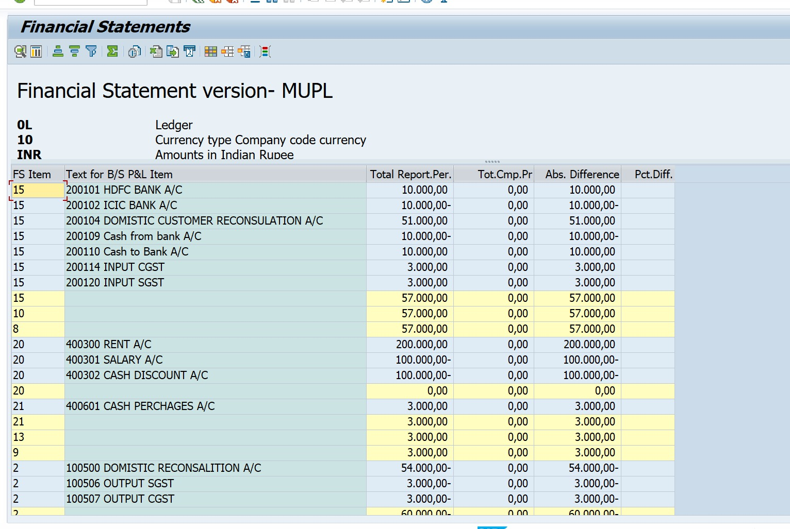

Project-10: SAP S/4HANA – Financial Statement Version (FSV)

 Business Scenario

Every organization needs to generate financial reports such as Balance Sheet and Profit & Loss Statement at month-end and year-end. To present financial data clearly to auditors and management, SAP provides the Financial Statement Version (FSV) to group GL accounts under meaningful heads (Assets, Liabilities, Income & Expenses).
This project demonstrates configuring FSV and generating the Financial Statement report.

---

 Business Objective

✔️ Create custom Financial Statement Version (FSV)
✔️ Insert reporting structure nodes
✔️ Assign GL accounts to reporting nodes
✔️ Execute and Print Financial Statement (F.01)

---

 SAP Configuration Steps (With T-Codes)

Step	Configuration Activity	T-Code

01	Create Financial Statement Version	OB58
02	Assign Chart of Accounts to FSV	OBY6
03	Insert Nodes (Assets, Liabilities, Income, Expenses)	OB58
04	Assign GL Accounts to relevant nodes	OB58
05	Execute Financial Statement Report	F.01
06	Print / Export Financial Statement	F.01

##  Screenshots

### 01. Create Financial Statement Version (OB58)

### 02. Assign Chart of Accounts to FSV (OBY6)

### 03. Insert Nodes – Assets / Liabilities / Income / Expenses (OB58)

### 04. Assign GL Accounts to Nodes (OB58)

### 05. Execute Financial Statement Report (F.01)

### 06. Print / Export Financial Statement (F.01)

Final Output

✔ Structured & meaningful Balance Sheet
✔ Profit & Loss Statement aligned with business reporting requirements
✔ Exportable format (PDF / Excel) for audits and compliance
