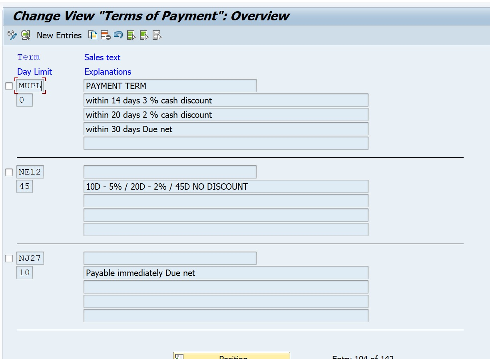
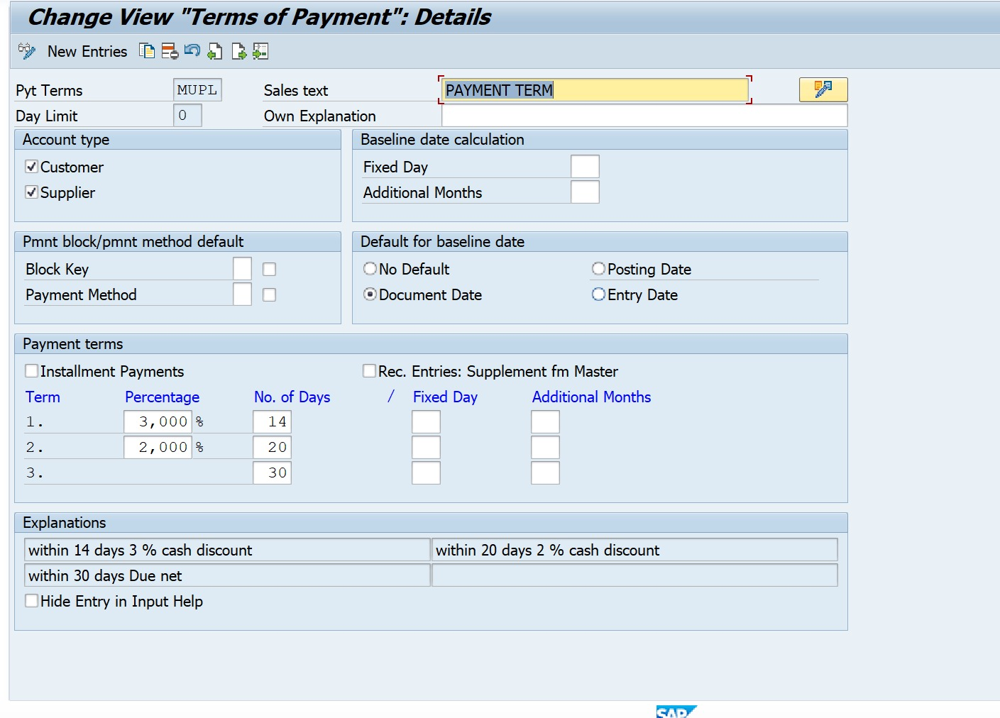
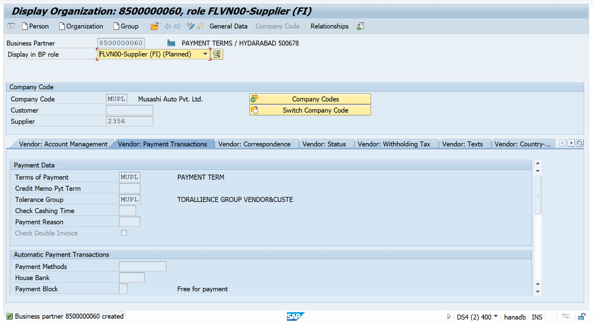
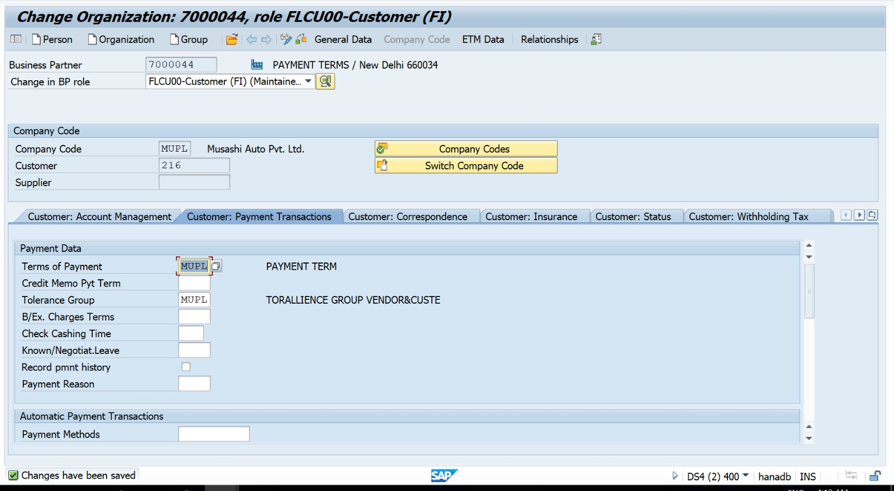
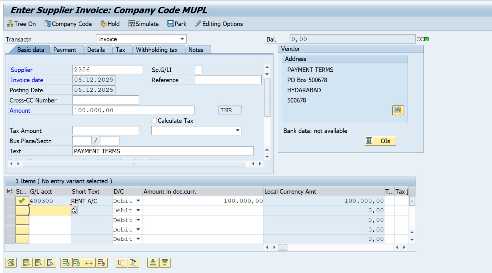
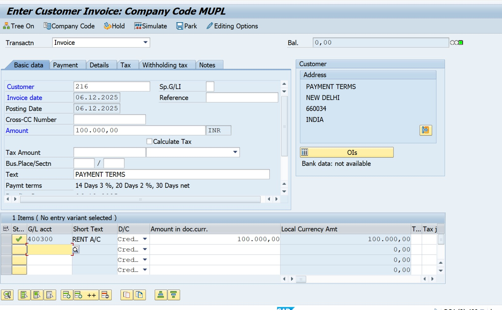
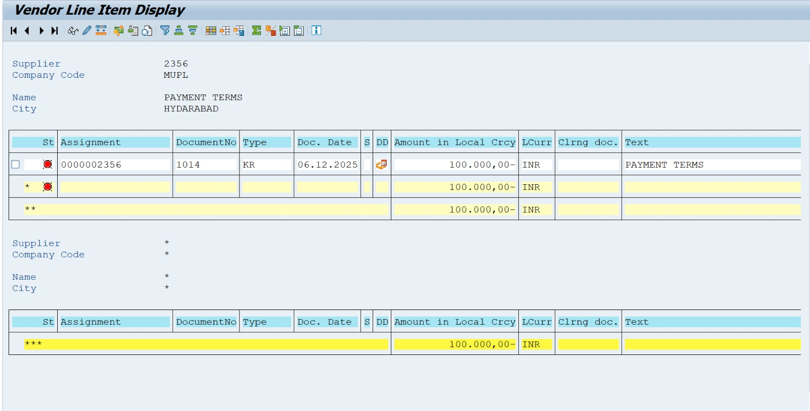
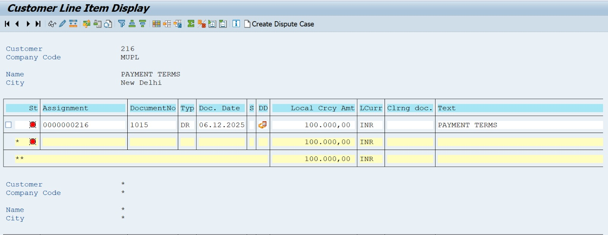

Project-12: SAP S/4HANA – Payment Terms Configuration

 Business Scenario

Musashi Auto Pvt. Ltd wants to automate due-date calculation and cash discount for vendor payments and customer invoices.
They require:

2% discount if paid within 10 days

Net due within 30 days

System should automatically calculate baseline date, due date, and discount in FB60 / FB70 postings.

---
## 🛠 SAP Configuration Steps (With T-Codes)

| Step | Configuration Activity | T-Code |
|------|------------------------|--------|
| 01 | Define Payment Terms | **OBB8** |
| 02 | Define Baseline Date Rules | **OBB8** |
| 03 | Add Installment Payment (Optional) | **OBB9** |
| 04 | Assign Payment Terms in Vendor Master | **BP** |
| 05 | Assign Payment Terms in Customer Master | **BP** |
| 06 | Vendor Invoice Posting | **FB60** |
| 07 | Customer Invoice Posting | **FB70** |
| 08 | Display Discount & Due-Date Calculation | **FBL1N / FBL5N** |

## 📄 Posting Example for Testing

| Type | T-Code | Amount | Payment Terms |
|------|--------|---------|----------------|
| Customer Invoice | **FB70** | **15,000 INR** | **2% 10 Days / Net 30** |
| Vendor Invoice | **FB60** | **20,000 INR** | **2% 10 Days / Net 30** |

##  Expected Output

✔ System automatically calculates discount  
✔ Due-date calculated using baseline rules  
✔ Correct discount GL posting (if configured in OBXR / OBXB)  
✔ Visible in **FBL1N / FBL5N** reports with discount & due-date tracking  
✔ Improves cash-flow and reduces manual calculations  

##  Business Outcome

📍 Automated payment cycle  
📍 Improves working capital management  
📍 Encourages early payments via discounts  
📍 Reduces manual processing errors
 Business Outcome

📌 Automated payment cycle
📌 Improves cash flow management
📌 Minimizes manual errors
📌 Discount benefits for early payment

###  Screenshots

 **Define Payment Terms**

 **Define Discount & Due-Date Rules**

 **Assign Payment Terms to Vendor**

 **Assign Payment Terms to Customer**

 **Vendor Invoice Discount Test**

 **Customer Invoice Discount Test**

 **Display Vendor Discount Calculation**

 **Display Customer Discount Calculation**

