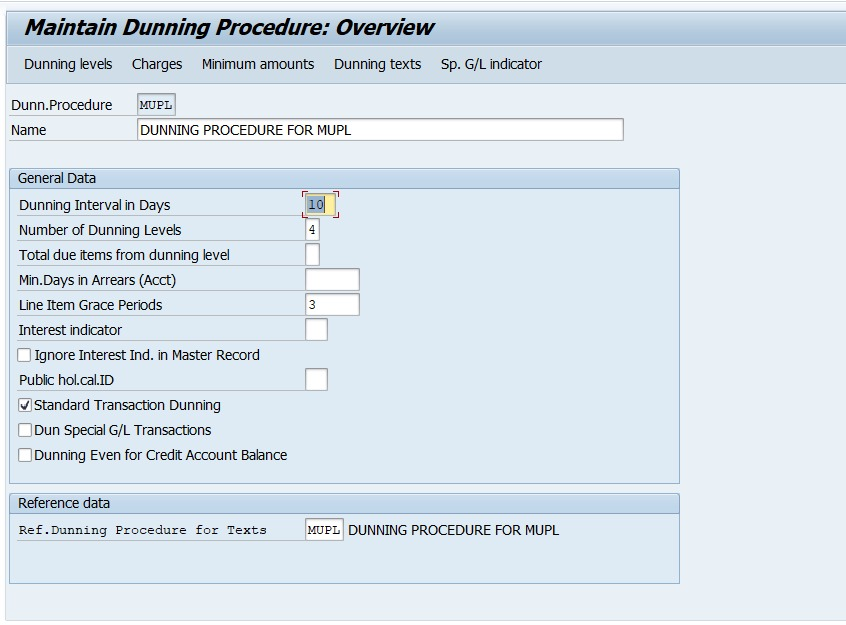
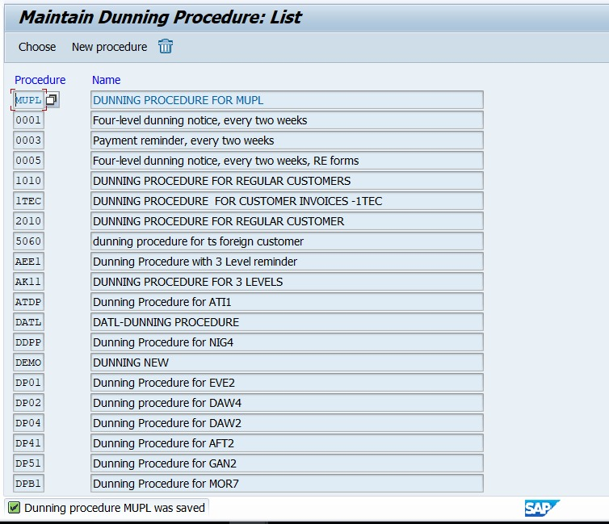
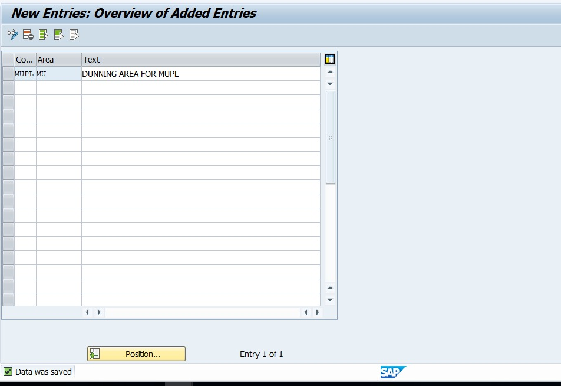
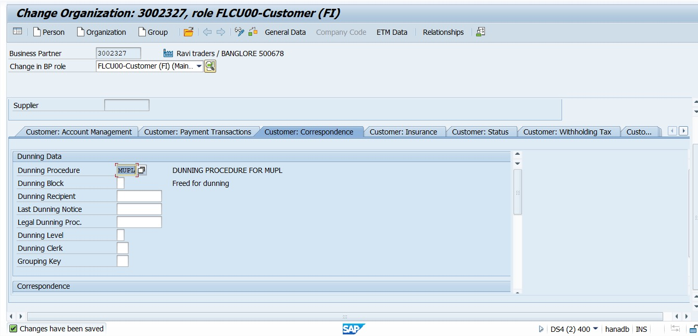
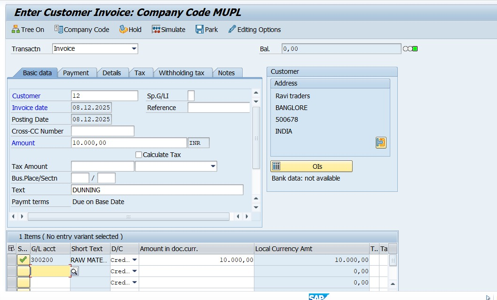
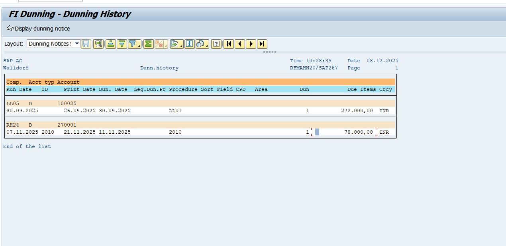
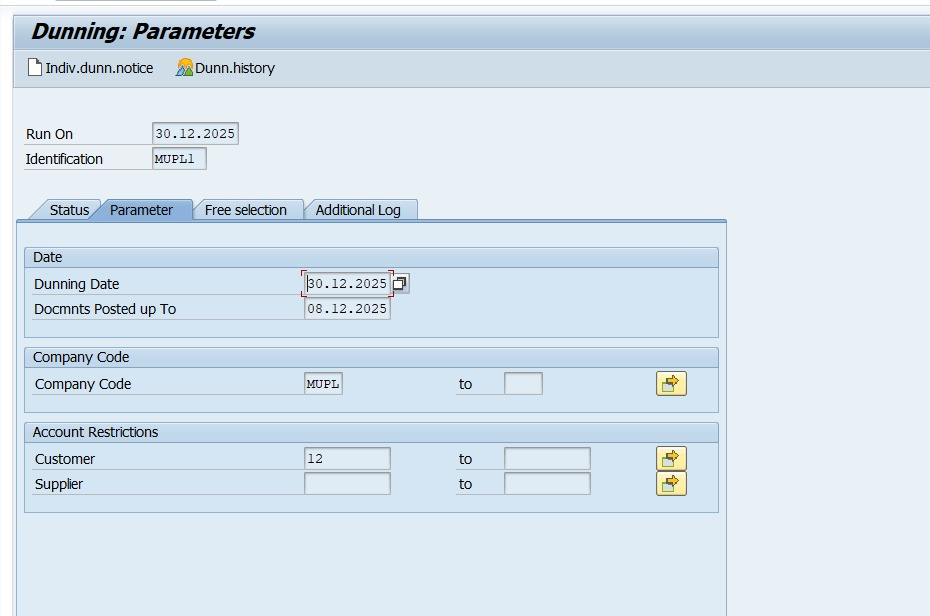

# Project 13 – SAP S/4HANA Dunning Process Configuration

## Business Scenario
Dunning process is used to remind customers regarding overdue outstanding invoices.  
It helps organizations to maintain cash-flow and payment discipline by sending automated reminder notices with different severity levels.

## 🛠 SAP Configuration Steps (With T-Codes)

| Step | Configuration Activity | T-Code |
|------|------------------------|--------|
| 01 | Maintain Dunning Procedure | **FBMP** |
| 02 | Maintain Dunning Levels & Charges | **FBMP** |
| 03 | Assign Dunning Procedure to Company Code | **FBMP** |
| 04 | Maintain Dunning Texts | **SE61** |
| 05 | Assign Dunning Procedure to Customer Master | **BP** |
| 06 | Post Overdue Customer Invoice | **FB70** |
| 07 | Execute Dunning Run | **F150** |
| 08 | Print / View Dunning Letter Output | **F150 (Spool)** |

---

##  Posting Example for Testing

| Customer | T-Code | Amount | Delay | Dunning Level |
|----------|--------|---------|--------|----------------|
| CUST-01 | **FB70** | 20,000 INR | 30 Days Overdue | Level-1 |

---

## 🎯 Expected Output
| Result |
|--------|
| ✔ Dunning proposal created successfully |
| ✔ Reminder letter generated in spool |
| ✔ Overdue amount displayed with dunning level |
| ✔ Payment follow-up automated |

---

##  Screenshots

---

##  Business Outcome
| Benefit |
|---------|
| 📍 Improved receivable follow-up |
| 📍 Automated customer reminders |
| 📍 Better cash-flow management |
| 📍 Reduced manual communication workload |
