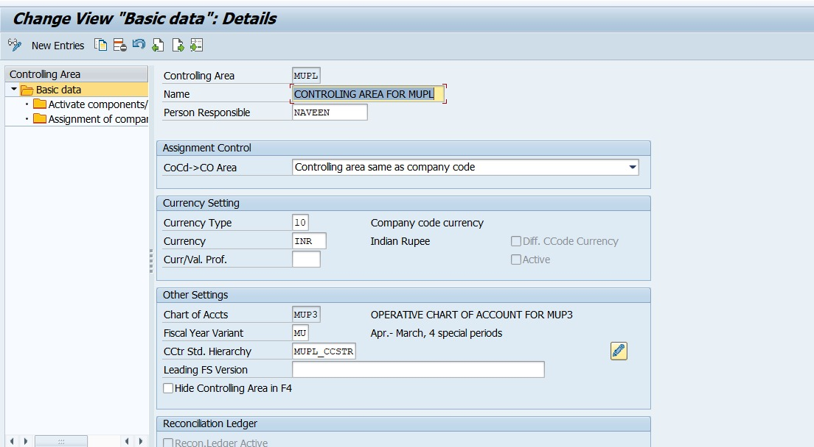
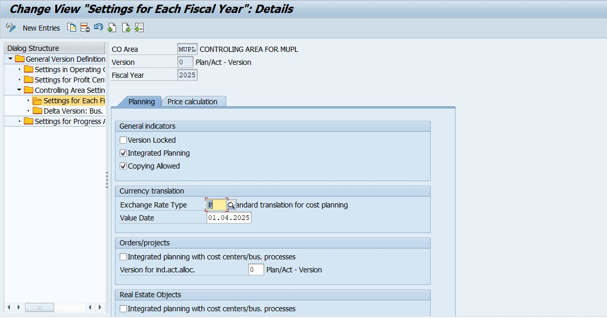
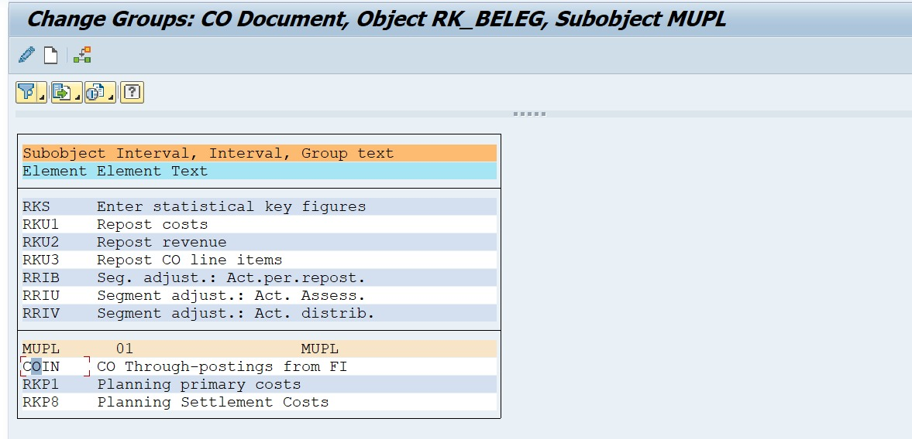
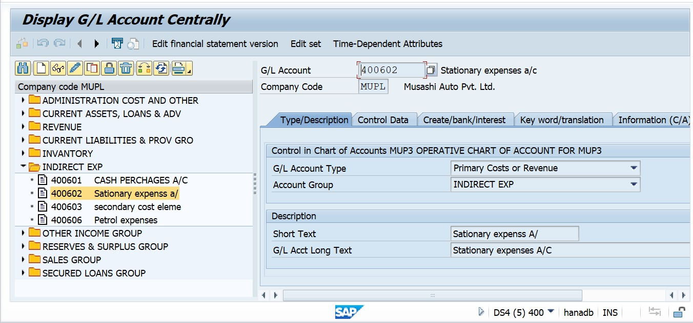
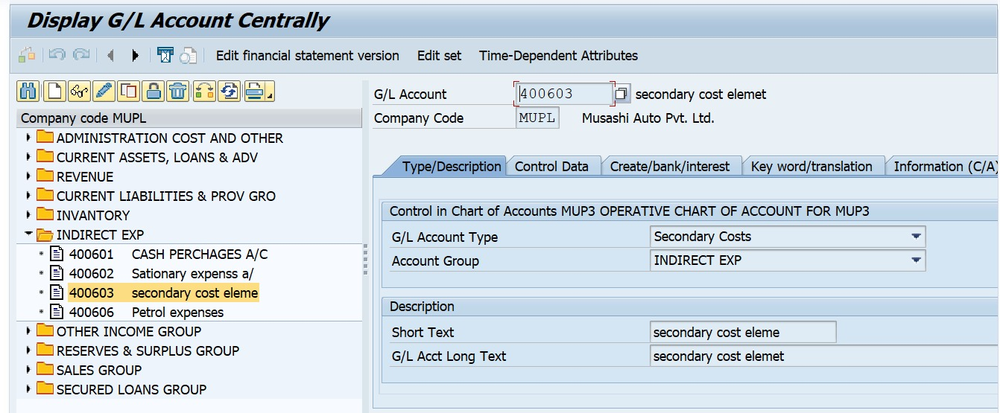
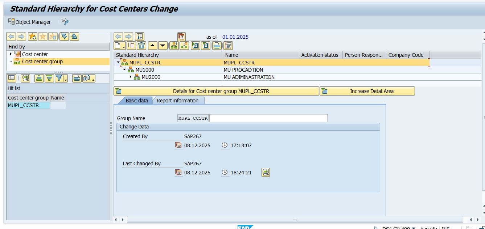
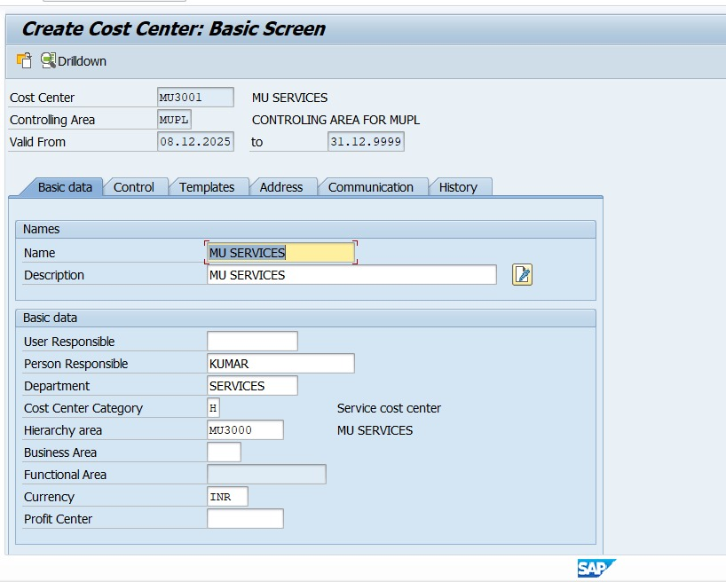
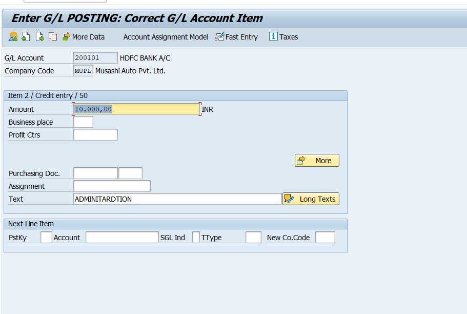
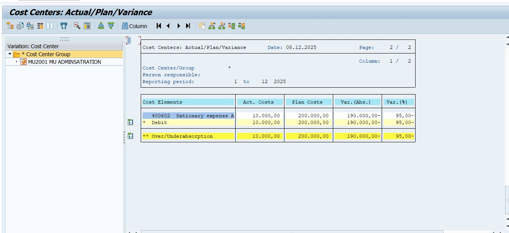

##  Project-14: SAP S/4HANA – Controlling (CO-CCA) – Cost Center Accounting

###  Business Scenario
Musashi Auto Pvt. Ltd. wants to manage internal expenses by department and analyze planned vs actual costs. Cost Center Accounting helps track overheads such as Stationary, Administration, and Petrol expenses and provides variance reporting to support decision-making and budgeting control.

---

##  SAP Configuration Steps (With T-Codes)

| Step | Configuration Activity | T-Code |
|------|------------------------|--------|
| 01 | Maintain Controlling Area | **OKKP** |
| 02 | Assign Company Code to Controlling Area | **OKKP** |
| 03 | Maintain Planning Version | **OKEQ** |
| 04 | Create Number Range for CO Documents | **KANK** |
| 05 | Create Primary Cost GL (Stationary Expense) | **FS00** |
| 06 | Create Secondary Cost Element | **FS00** |
| 07 | Create Cost Center Group | **OKEON** |
| 08 | Create Cost Center | **KS01** |
| 09 | Post Expense to Cost Center | **F-02** |
| 10 | Display Document Entry View | **FB03 / F-02 Display** |
| 11 | Cost Center Planning | **KP06** |
| 12 | Actual/Plan/Variance Report | **S_ALR_87013611** |

---

##  Posting Example for Testing

| Type | T-Code / Document | Amount | Cost Center |
|------|-------------------|---------|-------------|
| Stationary Expense Posting | **F-02** | **10,000 INR** | **MU2001 – Administration** |

---

##  Expected Output
✔ CO document automatically generated  
✔ Expense posted to cost center MU2001  
✔ Actual vs Planned variance calculated  
✔ Expense visible in KP06 planning report  
✔ Cost variance report visible in **S_ALR_87013611**  

---

##  Business Outcome
📍 Transparent control of internal business expenses  
📍 Improved planning & budgeting accuracy  
📍 Enhanced financial decision-making for management  
📍 Clear visibility of department-wise variances  

